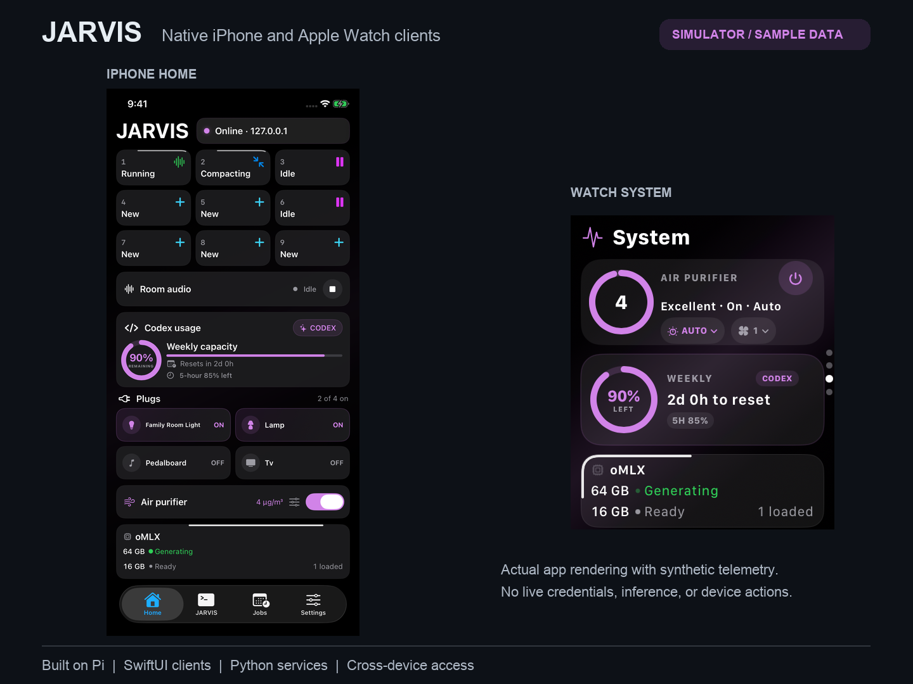

# JARVIS for iPhone and Apple Watch

**Native clients for a Mac-hosted AI workspace and connected-device controls.**

**Source candidate (not yet deployed):** oMLX cards use fixed host/status,
short model, generation t/s, and whole-Mac RAM columns with the same heading,
two rows, padding, and wrapper dimensions. No rotating pages or scrolling text.
Full model names remain available to VoiceOver; ambiguous concurrent work shows
`Multi` with no combined speed. RAM is independently tracked by jarvisd and never
substituted with oMLX memory; stale/missing readings show `—`. The update dot is
unchanged. See [backend memory telemetry](../jarvisd/README.md#whole-mac-ram-telemetry-source-only-not-yet-deployed).

**Current installed build:** 205 on both iPhone and Watch, with installation and
launch independently verified on 2026-09-20 EDT. Build 205 adds automatic oMLX detail
pages, full-name overflow scrolling, and a green dot immediately right of the
oMLX title when either server confirms an available update. Card dimensions remain
unchanged. The separate hourly backend release check is deployed; both servers
reported no update at verification. Both simulator targets build successfully;
physical visual acceptance remains pending. Build 204 is retained for rollback.

Build 204 added the matching purple tab accent, translucent iPhone purifier card,
softer Watch borders, and glass terminal accessory buttons.

Build 203 introduced native Liquid Glass
to selected controls and quieter translucent card surfaces, preserving layout,
interaction, and backend behavior. Older systems use material fallbacks; Reduce
Transparency and increased contrast use opaque surfaces. Simulator Home (light/dark)
and Watch System previews were reviewed; the owner visually approved build 203
on 2026-09-20 EDT.
The room endpoint is labelled
**Camera speaker**, and both terminal indicators group sessions **3 · 3 · 3 · 1**.
The Room Audio card opens shared Session 10; see
[rollout and remaining physical acceptance](docs/room-session10.md).
Device controls now use `/api/v1/device-command` with existing app authentication,
a per-command request ID and redirect refusal. No automatic write retry or legacy
fallback. See [native control update](docs/native-control-update.md).

I built these apps to reach my Mac-hosted Pi sessions and room controls from my phone and Watch. They also show system status and scheduled-job results. Both apps use SwiftUI, with shared networking and models in JARVISKit.

[Project overview](../../../README.md) · [Architecture](docs/architecture.md) · [Build and operations](docs/operations.md) · [Documentation index](docs/README.md)

## Simulator preview



[Short simulator video](../docs/media/jarvis-simulator-showcase.mp4) · [Full-size Home, System, and Jobs screenshots](../docs/media/README.md)

Captured in Apple simulators with sample data. The video shows the UI animations.

## In the apps

| Surface | Purpose |
|---|---|
| iPhone Home | Pi session status, plug and purifier controls, room-audio state, and read-only model-server telemetry. |
| iPhone terminal | SSH-backed access to persistent Pi sessions, with native keyboard controls. Photos/Files staging is gated by the signed build's attachment configuration. |
| Apple Watch | Terminal, Plugs, System, and Jobs pages, with bounded foreground refresh and explicit stale/unavailable states. |
| Jobs | Read-only schedules and saved per-job results. |
| Talk to JARVIS | A native Watch icon complication automatically opens native text input and submits once on native completion into the protected terminal service. Replaces Siri command registration on both platforms; signed deployment and physical acceptance are pending. See [setup and verification](docs/watch-talk-complication.md). |
| Widgets | Neural Core and Open JARVIS surfaces, separate from native hardware command controls. |
| Notifications | Opt-in scheduled-result and session-completion support. Signing, registration, permissions, and host activation are separate requirements. |

Feature availability depends on the client build and host configuration. The [status notes](docs/planned-work.md) track the build and deployment details that still need checking.

## How it fits together

- **iPhone terminal:** SwiftTerm and SwiftNIO SSH connect to fixed, persistent Mac-side Pi sessions.
- **Watch terminal and Talk prompt:** `terminald` provides a separate authenticated, certificate-pinned terminal bridge.
- **Device controls and status:** `jarvisd` serves cached telemetry and validated commands. Plug and purifier buttons call this API directly, without going through the model.
- **Shared code:** JARVISKit contains the API models, networking, stale-state handling, Watch bridge, and reusable UI components.

Pi runs the agent on the Mac. The apps connect to it rather than running a separate agent on each device.

## Source map

| Path | Responsibility |
|---|---|
| [`JARVIS/`](JARVIS/) | SwiftUI iPhone app, terminal, settings, and notification coordination. |
| [`JARVISWatch/`](JARVISWatch/) | Watch interface, terminal, device controls, and Jobs. |
| [`JARVISKit/`](JARVISKit/) | Shared models, networking, state policies, and tests. |
| [`JARVISWidget/`](JARVISWidget/), [`JARVISWatchWidget/`](JARVISWatchWidget/) | WidgetKit targets. |
| [`../jarvisd/`](../jarvisd/) | Shared Operation JARVIS backend (outside the app). |
| [`terminald/`](terminald/) | Isolated terminal relay. |
| [`project.yml`](project.yml) | XcodeGen project specification. |
| [`scripts/`](scripts/) | Verification, packaging, and guarded deployment helpers. |

## Neural Core artwork

[Neural Core C2 / Dendrites and beam motion](docs/neural-core-c2-candidate.md) preserve the silver-white palette and central focus, with subtle organic branches, brighter central highlights, and outward-travelling pulses. Build166 was installed and visually accepted on iPhone; Watch deployment of these changes remains unconfirmed. See the linked implementation record for verification and device-acceptance limits.

## Verification

On a configured Mac with the required Xcode components and dependencies, run from this directory in an **isolated development checkout**:

```bash
./scripts/verify-jarvis-app.sh
```

This regenerates the Xcode project, runs Python/Node/Swift checks, and builds simulator products, so it writes files in the checkout. Additional iOS tests and live integration tests are opt-in. See the [verification guide](docs/operations.md#verification) for flags and setup.

Representative tests: [daemon contracts](../jarvisd/tests/), [terminal relay](terminald/tests/), [shared Swift behavior](JARVISKit/Tests/JARVISKitTests/), and [iPhone app tests](JARVISTests/).

## Running the apps

This is a personal LAN/Tailscale deployment, not an App Store release. Keep credentials out of source control and check the [authentication and device-control rules](docs/architecture.md#security-and-trust-boundaries) before connecting to a host.

Use an isolated checkout for builds. Reviewing the project does not require restarting services, changing device configuration, or disturbing live Pi conversations. Signing, installation, and recovery have separate approval steps in the [operations guide](docs/operations.md).

## Further reading

- [Architecture and security](docs/architecture.md)
- [Verification, signing, deployment, and recovery](docs/operations.md)
- [Pending work and status reconciliation](docs/planned-work.md)
- [Development history](docs/development-history.md)
- [Implementation history](docs/implementation-history.md)

The history files preserve earlier work and build notes. Use the current guides for setup, not old deployment commands.
