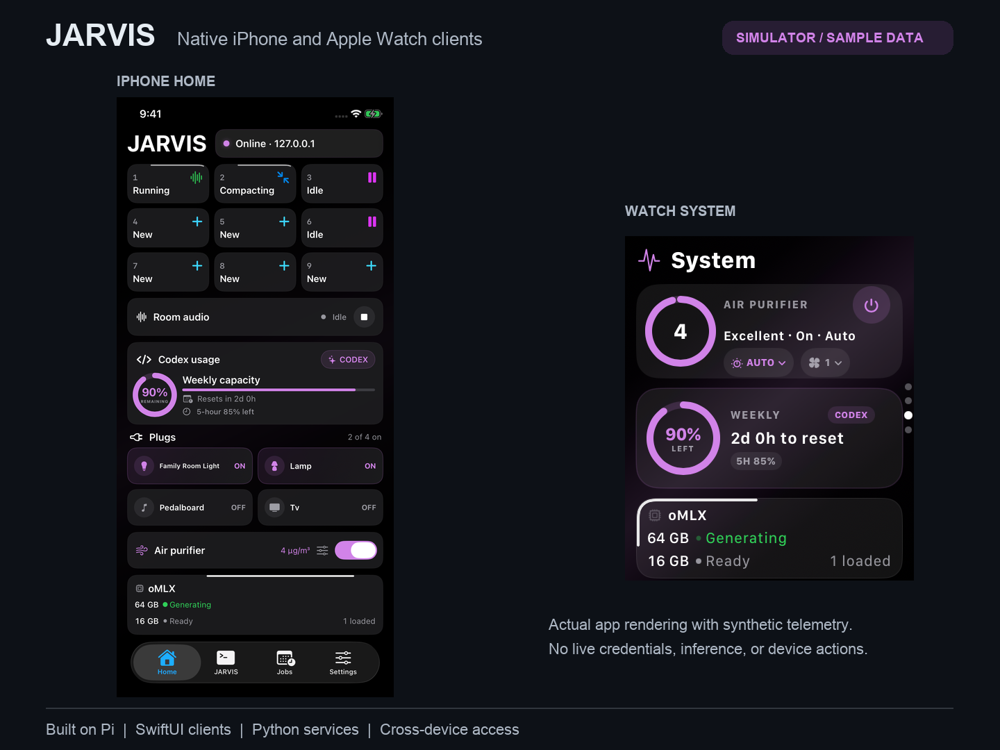

# JARVIS for iPhone and Apple Watch

**Native clients for a Mac-hosted AI workspace and connected-device controls.**

**Current verified iPhone build: 248**, installed once and independently
version/launch/process verified on **2026-10-04 at 12:58 EDT**. The nine Pi cards
now display their actual saved names rather than written status labels, with
unchanged numbers, 22-point status glyphs, 80 ms motion, dimensions and routes.
Long names truncate visually; VoiceOver retains the full name and lifecycle.
New unnamed sessions say New session; other missing names say Unnamed session.
Room Audio keeps its meaningful label and controls.

The matching backend was deployed at **12:55 EDT** from the exact installed
baseline, preserving unrelated code/configuration and restarting the daemon in
0.557 s with its watchdog coordinated. Live state verifies 7 saved names and
3 unnamed New slots. All 16 unrelated service records and existing Pi panes were
preserved; the subsequent iPhone install preserved all 18 service records.
Frozen release validation passed 173 iPhone tests, 301 shared tests (3 expected
skips), 37 terminal tests and both simulator builds; shipped-backend validation
passed 795 tests (the operational source candidate separately passed 891).
Candidate and exact iPhone rollback **247** passed four-bundle signing/profile/
entitlement/seal audits. No Pi reload/restart, household device command or direct
Watch install; Watch's last independent device verification remains 245. The owner
confirmed the physical appearance looks good; VoiceOver acceptance is unconfirmed.
See
[session-name contract and deployment](docs/pi-session-names.md).

**Previous verified iPhone build: 247**, installed once and independently
version/launch/process verified on **2026-10-04 at 11:17 EDT**. All dashboard
session glyphs, including Room Audio, are **22 pt instead of 18 pt** (22% larger),
with unchanged card footprints, labels, colours, routes and 80 ms cadence.
Phone/Watch Terminal capsules and Watch source are unchanged. All 169 iPhone tests,
296 shared tests (3 expected skips), 37 terminal tests and both simulator builds
passed from frozen source; the known plain-Paste pixel assertion remains excluded.
Candidate and exact signed rollback **246** passed four-bundle signature/profile/
unchanged-entitlement/dependency audits; existing signing identity/profiles were
reused. All 18 protected service records and existing Pi panes were preserved.
No backend/Pi restart or direct Watch install; iOS may sync the unchanged-source
embedded companion. Watch's last independent device verification remains **245**.
Physical larger-icon/VoiceOver acceptance awaits owner review. See
[larger indicators](docs/session-status-indicators.md#larger-dashboard-glyphs--build-247) and
[deployment checks](docs/operations.md#larger-dashboard-glyphs--build-247).

Owner-approved cleanup removed **1.17 GiB** of stale archives/build scratch.
Signed iPhone recovery builds **248/247** and Watch recovery builds **245/244**
remain verified and retained (older 246 also remains), along with historical source/audit/test evidence;
see [current retention](docs/operations.md#current-recovery-retention-and-cleanup).

**Previous verified iPhone build: 246**, installed once and independently
version/launch/process verified on **2026-10-04 at 10:42 EDT**. JARVIS's nine Pi
cards and Room Audio now use Pi-style braille for Running/Compacting at 80 ms/frame,
with distinct static glyphs for Idle/New/Offline/Unknown. Card labels, dimensions,
routes and phone/Watch Terminal capsules are unchanged. All 168 iPhone tests,
296 shared tests (3 expected skips), 37 terminal tests and both simulator builds
passed from frozen source; the known plain-Paste pixel assertion remains excluded.
Candidate and exact signed rollback **245** passed all four bundle/signature/profile/
unchanged-entitlement/dependency audits. All 18 protected service records and
existing Pi panes were preserved. No backend/Pi restart or direct Watch install;
iOS may sync the unchanged-source embedded companion. Watch's last independent
version/launch/process verification remains **245**. The owner accepted the
indicator appearance; VoiceOver acceptance remains unconfirmed. See
[session indicators](docs/session-status-indicators.md#dashboard-braille--build-246) and
[deployment checks](docs/operations.md#dashboard-braille--build-246).

**Previous iPhone and last independently verified Watch build: 245**, installed once on each device
and independently version/launch/process verified on **2026-10-04 at 09:43 EDT**.
Compacting is neutral grey `#8A8A8A`, matching Pi Desk. Exact signed build 244 is
retained for rollback on both devices.
The native app animations and other lifecycle colours are unchanged. Frozen-source
verification passed 163 iPhone tests, 290 shared tests (3 expected skips), 37
terminal tests and both simulator builds. Candidate and exact build-244 rollback
passed four-bundle signature/profile/entitlement/dependency audits. Protected
service PIDs and existing Pi panes were preserved; no backend/Pi restart or app-data
removal. Physical colour acceptance awaits owner review. See
[shared session colours](docs/session-status-indicators.md) and
[deployment checks](docs/operations.md#grey-compaction-palette--build-245).

**Previous verified iPhone build: 243**, installed once and independently
version/launch/process verified on **2026-10-02 at 16:06 EDT**. Settings now uses
four equal Liquid Glass summary cards, a full-width Diagnostics & Maintenance card,
and separate glass detail pages for editing credentials/endpoints and notification
provider controls. The Alerts toggle remains directly accessible. All **163 iPhone
tests passed** from frozen source (the documented plain-Paste pixel test remains
excluded); the signed four-bundle audit passed. Exact build 242 is retained for
rollback. All 18 protected service PIDs and existing Pi panes were preserved.
No backend restart or direct Watch install; iOS may sync the embedded companion.
Physical layout/keyboard/VoiceOver acceptance awaits owner review. See
[balanced Settings](docs/navigation-and-home.md#balanced-settings-grid--build-243)
and [deployment checks](docs/operations.md#balanced-settings-grid--build-243).

**Previous verified iPhone build: 242**, installed once and independently
version/launch/process verified on **2026-10-02 at 15:40 EDT**. Settings now exposes
six inline Liquid Glass cards without card navigation, disclosures or internal
scrolling. Populated portrait settings fit above the tab bar in the iPhone 11
simulator; page overflow remains available for large text, errors and the keyboard.
All **160 iPhone tests passed** (the previously documented plain-Paste pixel test
remains excluded), and the signed archive passed its four-bundle audit. Exact
build 241 is retained for rollback. All 18 protected service PIDs and existing
Pi panes were preserved. No backend restart or direct Watch install was performed;
iOS may automatically transfer the embedded, unchanged-source companion. Watch's
last independent device verification remains build 241. Owner review rejected
build 242's uneven card sizes; build 243 supersedes that layout.
See [inline Settings](docs/navigation-and-home.md#inline-iphone-settings--build-242)
and [deployment checks](docs/operations.md#inline-iphone-settings--build-242).

**Previous iPhone and Watch build: 241**, installed once on both devices and
independently version/launch/process verified on **2026-10-02 at 13:23 EDT**.
Matching directional swipe animations use a 300 ms slide/fade, with Reduce Motion
support and unchanged Terminal session gestures. 155 iPhone tests and 289 shared
tests (3 expected skips), both simulator builds and the signed archive audit passed.
The initial Watch preflight disconnected before any device write; installation
succeeded after the owner woke/unlocked the paired devices.
iPhone remains **JARVIS → Home → Terminal → Jobs → Settings**, with health, plugs
and purifier grouped under Home and horizontal tab swipes excluded on Terminal.
Watch restores **Home → Terminal → Plugs → JARVIS → Jobs**: health-only Home,
dedicated plug grid, and purifier above Codex/oMLX on JARVIS.
Build 240's exact signed archive is retained for rollback. All 18 protected service
PIDs and existing Pi panes were preserved; see
[deployment checks](docs/operations.md#matching-swipe-animation--build-241).
Completion alerts can be reopened after handling; the separately approved terminal
bridge update prevents an unfinished TLS handshake from blocking other clients.
Credentials, dependency lock and entitlements were preserved.
See [navigation](docs/navigation-and-home.md) and
[recovery, tests and rollout](docs/terminal-recovery-and-notification-taps.md).
Physical gesture/notification acceptance remains pending owner review.
Installed-build records below describe earlier releases.

**Earlier iPhone and Watch build: 231**, installed once on each device and independently
version/launch/process verified on 2026-09-30 at **12:59 EDT**. The isolated signed
release includes cached sensor-read health, backend overall guards and history
compatibility, with no extra polling or credential setup. Four bundles/profiles,
unchanged entitlements and the pinned dependency lock were audited; frozen validation
passed **307 app tests, with 3 expected skips**. Build 230 is retained for rollback;
owner-approved cleanup retires superseded build 229 and sensor-update build caches. Sixteen protected service identities/configuration
hashes, tmux panes, credentials and production database identities were unchanged.
No backend/Pi restart or app-data removal. Cached localhost state/history checks
returned 200; physical visual, gesture and direct-route acceptance await owner review.

**Previous checkpoint: build 230**, installation, launch/process and final
version readbacks independently verified on both devices on 2026-09-30 at 08:35 EDT.
[System history UI](docs/system-history-ui.md) preserves the segmented current-check
ring, four 24-hour iPhone bands and one-hour Watch band, with missing/partial coverage,
separate inspectors and visibility-only reads. Build 230 removes the history-only
missing-token gates; 291 tests pass, with 3 expected live-test skips. The isolated
signed archive and all four bundles were audited with unchanged entitlements and
dependencies. Build 229 is the retained app rollback; owner-approved cleanup
retires superseded builds 227/228 and temporary build data. One install per
device; no app data removal, backend service or Pi-session restarts during installation.
Sixteen protected service identities/configuration hashes and tmux panes matched
before/after. Tokenless localhost history reads returned 200; physical history UI
and visual/gesture acceptance await owner review.

**Installed sensor-health update (build 231):** shared phone/Watch System
presentation consumes cached `health.components.security` and guards against an
unhealthy/unverified backend overall summary. Sensor read failures are issues;
expired, missing or malformed evidence stays unknown. The compact Watch grid
still has six chips, with service-data details retained in its existing inspector.
History accepts the new sanitized sensor reasons without changing coverage,
authorization, request cadence or routes.
See [sensor-health behavior](docs/system-dashboard.md#sensor-inclusive-update-build-231).

**History access correction:** [Existing dashboard authorization](docs/api-authentication.md)
removes the additional history-only token requirement at the owner's request.
Trusted-network users need no credential setup; token-mode backends retain their
existing API-token policy. No credentials are exported or injected.

**Previous iPhone and Watch build:** 228, installation, launch and final build
readback independently verified on both devices on 2026-09-29 at 19:50 EDT.
[System](docs/system-dashboard.md) now uses compact Home-style cards with a
one-screen overview; technical details open in separate sheets. No overview
scrolling, large stat tiles, or inline expansion. iPhone keeps Home → System →
JARVIS → Jobs → Settings. On Watch, swipe down from Terminal to System and up to
return; the former System page remains Overview.

The exact signed archive and all four bundles were audited with unchanged
entitlements. 267 tests pass, with 3 expected live-test skips. Build 227 is retained
for rollback; no app data removed, backend services or Pi sessions restarted.
The Watch connection dropped before its install step and was re-established;
neither device received a duplicate install. Physical visual and gesture
acceptance remains pending owner review.

**Earlier iPhone UI (build 221):** installation and launch verified on 2026-09-23 EDT.
Visibility fix: widget artwork renders at 140-point height behind the full header
width, cropped to an owner-approved 84-point band (double the previous height).
A rendered preview confirms visible core and filaments around JARVIS.
The title backdrop now reuses the widget's actual Cathedral artwork and two-second
motion cycle, rather than the earlier orbital approximation. The iPhone target
includes the shared NeuralCoreArtwork/C2Decoration sources, without changing widgets.
All artwork layers render in original widget white/silver behind the purple title; the widget
wordmark is omitted. Neutral telemetry avoids invented readings. Its own bounded clock follows the title's
visibility policy and retains Reduce Motion handling.
Home now combines connection state into the centered JARVIS title: app-purple
reactor ignition, then a continuous 3.6-second energy sweep/ripple and slow glow.
Status stays in the remaining trailing space without shifting the title. The Online/Tailscale pill is
removed; exceptional states retain a compact text label and VoiceOver status.
Original title dimensions are preserved; the header minimum height is now 84 points.
Effects pause offscreen/inactive and become static with Reduce Motion.
Physical-device visual acceptance remains pending.
The attachment sheet now offers **Take Photo** above Photos and Files. It requests
camera access, captures a JPEG into the existing private attachment draft, and
does not save to the photo library. Cancellation, unavailable/denied camera,
size limits, and temporary-file cleanup are handled. Full-screen camera coverage
does not disconnect Pi; real tab exits/backgrounding retain their cleanup.
Camera permission and capture acceptance on the physical iPhone remain pending.
Attach is now in the bottom terminal bar between Down and Paste, using the same
rounded glass key surface as the other controls. Tab is removed; the bar remains
eight controls wide. The top-right overlay is again only the session indicator.
Build 220 is retained for rollback. All 39 selected attachment/terminal/title tests
passed, including widget-cycle timing, continuous energy cycling, centered-title status clearance,
ignition timing, reduced-motion behavior, unchanged title footprint,
four camera tests, toolbar order and rendered layouts; the pre-existing plain-Paste
pixel test was excluded after its identical baseline failure in build 211.
Signed archive, four nested bundles, profiles, and unchanged entitlements verified.
No direct Watch deployment or host service/session restart was performed.
Physical attachment-flow acceptance is pending owner review.

**Previous UI rollout:** Build 206 on both iPhone and Watch, with installation and
launch independently verified on 2026-09-20 EDT. oMLX cards now use fixed host/status,
short model, generation t/s, and whole-Mac RAM columns with the same heading,
two rows, padding, and wrapper dimensions. No rotating pages or scrolling text.
Full model names remain available to VoiceOver; ambiguous concurrent work shows
`Multi` with no combined speed. RAM is independently tracked by jarvisd and never
substituted with oMLX memory; stale/missing readings show `—`. The update dot is
unchanged. See [backend memory telemetry](../jarvisd/README.md#whole-mac-ram-telemetry).

All 67 focused tests passed; both simulator targets build successfully. iPhone 11
and Watch SE 40mm layouts were reviewed; physical visual acceptance remains
pending. Build 205 is retained for rollback. All simulators are shut down.

Build 205 introduced the confirmed-update title dot and rotating details, now
replaced by build 206's stationary columns. The independent hourly release check
remains deployed; both servers reported no update at build 206 verification.

Build 204 added the matching purple tab accent, translucent iPhone purifier card,
softer Watch borders, and glass terminal accessory buttons.

Build 203 introduced native Liquid Glass
to selected controls and quieter translucent card surfaces, preserving layout,
interaction, and backend behavior. Older systems use material fallbacks; Reduce
Transparency and increased contrast use opaque surfaces. Simulator Home (light/dark)
and Watch System previews were reviewed; the owner visually approved build 203
on 2026-09-20 EDT.
The room endpoint is labelled
**Camera speaker**, and both terminal indicators group sessions **3 · 3 · 3 · 1**.
The Room Audio card opens shared Session 10; see
[rollout and remaining physical acceptance](docs/room-session10.md).
Device controls now use `/api/v1/device-command` with existing app authentication,
a per-command request ID and redirect refusal. No automatic write retry or legacy
fallback. See [native control update](docs/native-control-update.md).

I built these apps to reach my Mac-hosted Pi sessions and room controls from my phone and Watch. They also show system status and scheduled-job results. Both apps use SwiftUI, with shared networking and models in JARVISKit.

[Project overview](../../../README.md) · [Architecture](docs/architecture.md) · [Build and operations](docs/operations.md) · [Documentation index](docs/README.md)

## Simulator preview



[Short simulator video](../docs/media/jarvis-simulator-showcase.mp4) · [Full-size Home, System, and Jobs screenshots](../docs/media/README.md)

Captured in Apple simulators with sample data. The video shows the UI animations.

## In the apps

| Surface | Purpose |
|---|---|
| iPhone JARVIS | Pi session status, room-audio state, Codex quota and read-only model-server telemetry. |
| iPhone Home | Health/history, smart plugs and purifier controls. |
| iPhone terminal | SSH-backed access to persistent Pi sessions, with native keyboard controls. Photos/Files staging is gated by the signed build's attachment configuration. |
| Apple Watch | JARVIS, Home, Terminal and Jobs pages, with bounded foreground refresh and explicit stale/unavailable states. |
| Jobs | Read-only schedules and saved per-job results. |
| Talk to JARVIS | A native Watch icon complication automatically opens native text input and submits once on native completion into the protected terminal service. Replaces Siri command registration on both platforms; signed deployment and physical acceptance are pending. See [setup and verification](docs/watch-talk-complication.md). |
| Widgets | iPhone: Neural Core and Open JARVIS. Watch: those two plus Talk to JARVIS (fixed Session 10 input). No household-device write controls. |
| Notifications | Opt-in scheduled results and intentional Pi `notify(title, message)` alerts; automatic session-finish alerts are retired. Signing, registration, permissions, and host activation are separate requirements. |

Feature availability depends on the client build and host configuration. The [status notes](docs/planned-work.md) track the build and deployment details that still need checking.

## How it fits together

- **iPhone terminal:** SwiftTerm and SwiftNIO SSH connect to fixed, persistent Mac-side Pi sessions.
- **Watch terminal and Talk prompt:** `terminald` provides a separate authenticated, certificate-pinned terminal bridge.
- **Device controls and status:** `jarvisd` serves cached telemetry and validated commands. Plug and purifier buttons call this API directly, without going through the model.
- **Shared code:** JARVISKit contains the API models, networking, stale-state handling, Watch bridge, and reusable UI components.

Pi runs the agent on the Mac. The apps connect to it rather than running a separate agent on each device.

## Source map

| Path | Responsibility |
|---|---|
| [`JARVIS/`](JARVIS/) | SwiftUI iPhone app, terminal, settings, and notification coordination. |
| [`JARVISWatch/`](JARVISWatch/) | Watch interface, terminal, device controls, and Jobs. |
| [`JARVISKit/`](JARVISKit/) | Shared models, networking, state policies, and tests. |
| [`JARVISWidget/`](JARVISWidget/), [`JARVISWatchWidget/`](JARVISWatchWidget/) | WidgetKit targets. |
| [`../jarvisd/`](../jarvisd/) | Shared Operation JARVIS backend (outside the app). |
| [`terminald/`](terminald/) | Isolated terminal relay. |
| [`project.yml`](project.yml) | XcodeGen project specification. |
| [`scripts/`](scripts/) | Verification, packaging, and guarded deployment helpers. |

## Neural Core artwork

[Neural Core C2 / Dendrites and beam motion](docs/neural-core-c2-candidate.md) preserve the silver-white palette and central focus, with subtle organic branches, brighter central highlights, and outward-travelling pulses. Build166 was installed and visually accepted on iPhone; Watch deployment of these changes remains unconfirmed. See the linked implementation record for verification and device-acceptance limits.

## Pi session status colours

Compacting now uses neutral grey `#8A8A8A`, mirrored exactly by Pi Desk,
while New remains cyan. Native animations and other lifecycle colours are unchanged.
Build 245 was installed once and independently version/launch/process verified on
both iPhone and Watch on 2026-10-04 at 09:43 EDT. Exact signed build 244 is retained
for rollback; physical palette acceptance awaits owner review.
See [shared session colours](docs/session-status-indicators.md).

## Verification

On a configured Mac with the required Xcode components and dependencies, run from this directory in an **isolated development checkout**:

```bash
./scripts/verify-jarvis-app.sh
```

This regenerates the Xcode project, runs Python/Node/Swift checks, and builds simulator products, so it writes files in the checkout. Additional iOS tests and live integration tests are opt-in. See the [verification guide](docs/operations.md#verification) for flags and setup.

Representative tests: [daemon contracts](../jarvisd/tests/), [terminal relay](terminald/tests/), [shared Swift behavior](JARVISKit/Tests/JARVISKitTests/), and [iPhone app tests](JARVISTests/).

## Running the apps

This is a personal LAN/Tailscale deployment, not an App Store release. Keep credentials out of source control and check the [authentication and device-control rules](docs/architecture.md#security-and-trust-boundaries) before connecting to a host.

Use an isolated checkout for builds. Reviewing the project does not require restarting services, changing device configuration, or disturbing live Pi conversations. Signing, installation, and recovery have separate approval steps in the [operations guide](docs/operations.md).

## Further reading

- [Architecture and security](docs/architecture.md)
- [Verification, signing, deployment, and recovery](docs/operations.md)
- [Pending work and status reconciliation](docs/planned-work.md)
- [Development history](docs/development-history.md)
- [Implementation history](docs/implementation-history.md)

The history files preserve earlier work and build notes. Use the current guides for setup, not old deployment commands.
